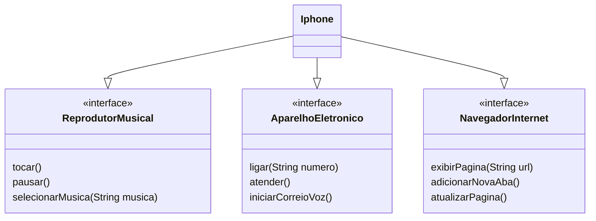

# Modelagem e Diagramação de um Componente iPhone

### Curso DIO: Modelando o iPhone com UML: Funções de Músicas, Chamadas e Internet

## Autor
- Gabriel Lins

## Diagrama UML:

```mermaid
classDiagram
    class ReprodutorMusical {
        <<interface>>
        tocar()
        pausar()
        selecionarMusica(String musica)
    }

    class AparelhoEletronico {
        <<interface>>
        ligar(String numero)
        atender()
        iniciarCorreioVoz()
    }

    class NavegadorInternet {
        <<interface>>
        exibirPagina(String url)
        adicionarNovaAba()
        atualizarPagina()
    }

    Iphone --|> ReprodutorMusical
    Iphone --|> AparelhoEletronico
    Iphone --|> NavegadorInternet


```
